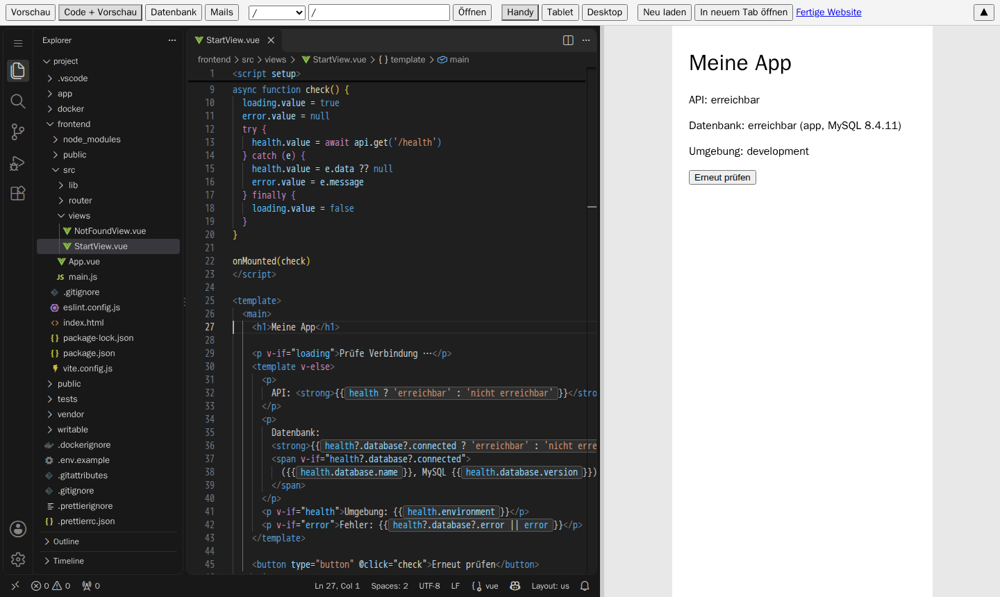
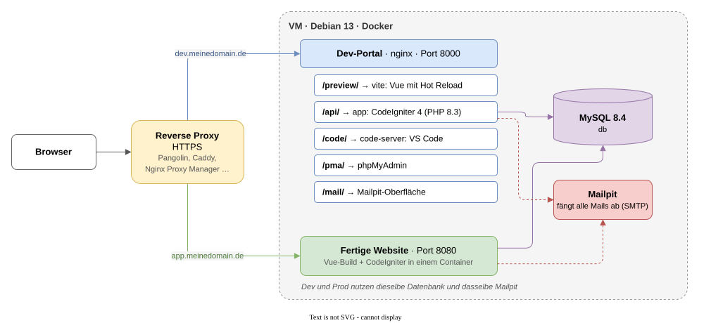
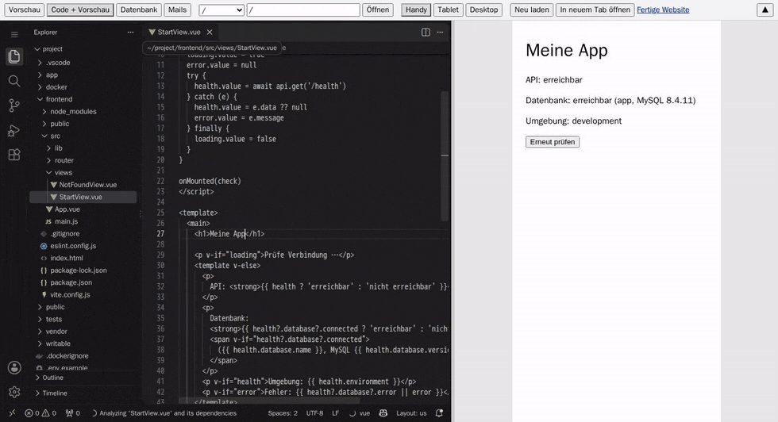
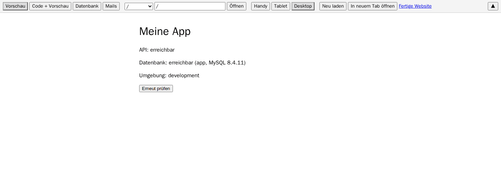
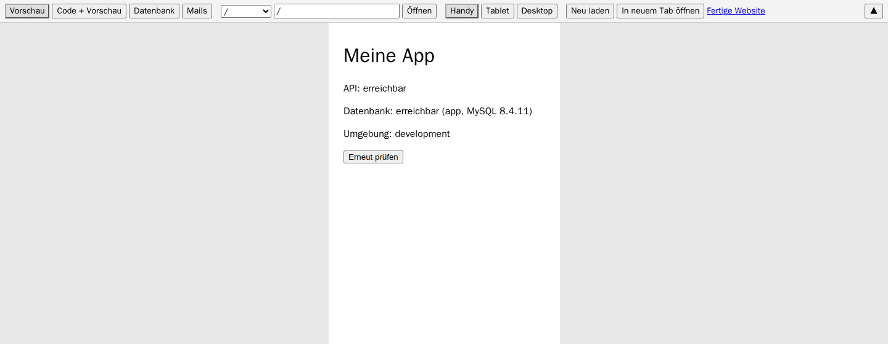
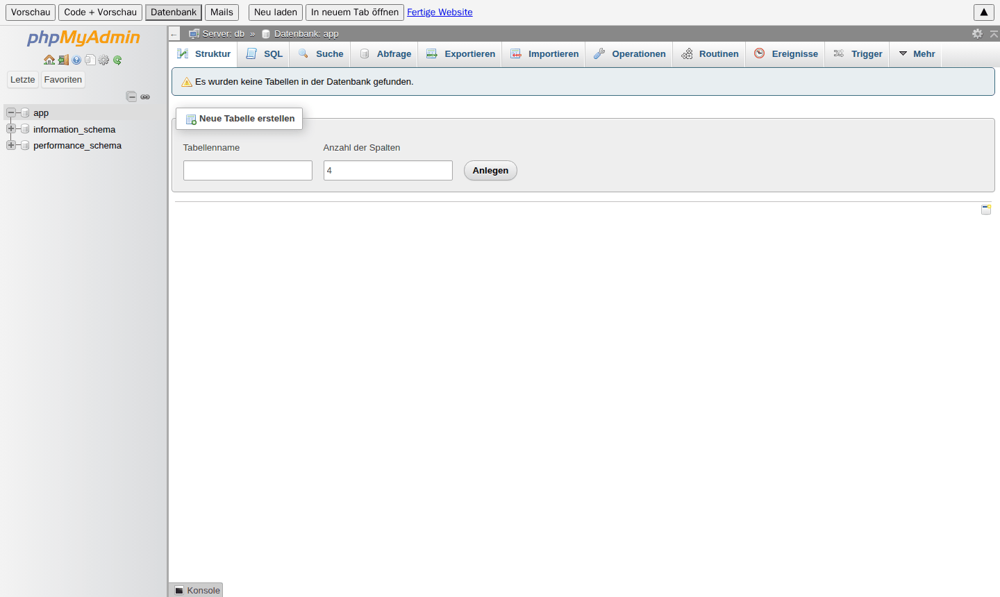
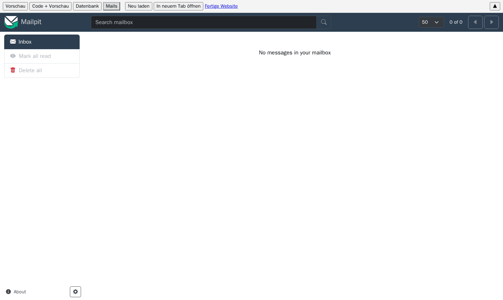

# Dev-Portal-Vorlage: CodeIgniter 4 + Vue 3 + Docker

Fertig eingerichtete Entwicklungs- und Hosting-Umgebung für eine Webanwendung
mit **CodeIgniter 4** (PHP-Backend als JSON-API) und **Vue 3 mit Vite**
(Frontend), inklusive **Gridstack.js** für Drag-and-Drop-Raster. Alles läuft
in einer VM in Docker und ist im Browser erreichbar:

- **Dev-Portal** (eine Adresse, z. B. `https://dev.meinedomain.de`)
  - Vorschau der App mit Hot Reload (Änderungen erscheinen sofort)
  - VS Code im Browser (code-server) mit git, PHP, Composer und Node
  - phpMyAdmin für die Datenbank
  - Mailpit: fängt alle Mails ab, die die App verschickt
  - Umschalten zwischen Handy-, Tablet- und Desktop-Breite
- **Fertige Website** (z. B. `https://app.meinedomain.de`): gebaute Version
  der App, wie sie später echte Besucher sehen



Die Vorlage enthält nur das Grundgerüst: eine API-Route `/api/health` und eine
Vue-Startseite, die anzeigt, ob API und Datenbank erreichbar sind. Den Rest
baust du selbst.

---

## Schnellstart (für Erfahrene)

```
# Auf dem Proxmox-Host (optional, legt eine Debian-13-VM an):
curl -fsSLO https://raw.githubusercontent.com/DevLunaris/dev-portal-template/main/create-vm.sh
bash create-vm.sh

# In der VM (Debian 13, Benutzer mit sudo):
sudo apt-get update && sudo apt-get install -y git
git clone https://github.com/DevLunaris/dev-portal-template.git mein-projekt
cd mein-projekt && ./bootstrap.sh

# Danach ins eigene, leere Repo pushen:
git remote set-url origin https://github.com/<DU>/<DEIN-REPO>.git
git push -u origin main
```

Reverse Proxy: Dev-Domain → `VM-IP:8000` (mit Login schützen, Websockets an),
App-Domain → `VM-IP:8080`. Ausführlich: siehe unten.

---

## Inhalt

1. [Schnellstart (für Erfahrene)](#schnellstart-für-erfahrene)
2. [Wie das Ganze aufgebaut ist](#wie-das-ganze-aufgebaut-ist)
3. [Voraussetzungen](#voraussetzungen)
4. [Einrichtung Schritt für Schritt](#einrichtung-schritt-für-schritt)
5. [Reverse Proxy einrichten](#reverse-proxy-einrichten)
6. [Täglich damit arbeiten](#täglich-damit-arbeiten)
7. [Lokal ohne VM entwickeln (optional)](#lokal-ohne-vm-entwickeln-optional)
8. [Projektstruktur](#projektstruktur)
9. [Sicherheit](#sicherheit)
10. [Fehlerbehebung](#fehlerbehebung)

---

## Wie das Ganze aufgebaut ist



Das Dev-Portal liefert alle Werkzeuge unter einer Adresse aus: `/` (Portal),
`/preview/` (App mit Hot Reload), `/api/` (CodeIgniter), `/code/`
(VS Code), `/pma/` (phpMyAdmin) und `/mail/` (Mailpit). Die fertige Website
läuft getrennt davon auf Port 8080.

Frontend und API laufen immer unter derselben Adresse. Vue ruft die API über
`/api/...` auf, dadurch sind keine CORS-Einstellungen nötig.

## Voraussetzungen

| Was | Wofür |
|---|---|
| **Proxmox-VE-Server** mit 4 freien CPU-Kernen, 8 GB RAM und 50 GB Speicher | Darauf läuft die VM. Ohne Proxmox geht auch jede andere Debian-13-VM oder ein Debian-13-Rechner, dann Schritt 1 überspringen. |
| **GitHub-Konto** (oder GitLab, Gitea …) | Für dein eigenes Repo |
| **Eine Domain** mit zwei Subdomains, z. B. `dev.meinedomain.de` und `app.meinedomain.de` | Adressen für Dev-Portal und fertige Website |
| **Ein Reverse Proxy mit HTTPS**, der die VM erreicht | Leitet die Domains an die VM weiter, siehe [Reverse Proxy einrichten](#reverse-proxy-einrichten) |
| **SSH-Client** auf deinem PC | Windows 10/11: in PowerShell ist `ssh` schon eingebaut |

Vorwissen in Linux oder Docker ist nicht nötig. Du musst nur Befehle
kopieren, einfügen und ein paar Fragen beantworten.

## Einrichtung Schritt für Schritt

### Schritt 1: VM auf Proxmox anlegen

Hast du schon eine Debian-13-VM (oder einen Debian-13-Rechner), überspringe
diesen Schritt.

1. Öffne in Proxmox die Shell des Hosts (im Webinterface links den Server
   anklicken, dann oben rechts **Shell**).
2. Lade das Skript herunter und starte es:

   ```
   curl -fsSLO https://raw.githubusercontent.com/DevLunaris/dev-portal-template/main/create-vm.sh
   bash create-vm.sh
   ```

   Es fragt nach VMID, Name, Storage, Netzwerk-Bridge, CPU, RAM, Disk, IP
   (leer lassen = DHCP) und einem SSH-Schlüssel. Mit **Enter** übernimmst du
   den Vorschlag in eckigen Klammern. Vor dem Anlegen zeigt es eine
   Zusammenfassung und fragt noch einmal nach.

   Zum SSH-Schlüssel: Wenn du keinen hast, lass das Feld leer. Dann erzeugt
   das Skript einen auf dem Proxmox-Host, und du loggst dich von dort aus in
   die VM ein. Besser ist ein Schlüssel von deinem PC: Dort in PowerShell
   `ssh-keygen -t ed25519` ausführen, die Datei
   `C:\Users\<du>\.ssh\id_ed25519.pub` auf den Host kopieren und den Pfad
   angeben.

3. Am Ende zeigt das Skript **MAC-Adresse** und **IP-Adresse** der VM an.

### Schritt 2: Feste IP im Router reservieren

Damit die VM immer dieselbe Adresse bekommt, im Router (z. B. Fritzbox oder
Router des Providers) unter DHCP für die angezeigte MAC-Adresse eine feste
IP reservieren. Bei einer festen IP aus Schritt 1 entfällt das.

### Schritt 3: In die VM einloggen und git installieren

Auf deinem PC (Windows: PowerShell):

```
ssh debian@<IP-DER-VM>
```

(`debian` ist der Standardbenutzer aus Schritt 1.) Dann in der VM:

```
sudo apt-get update && sudo apt-get install -y git
```

### Schritt 4: Vorlage holen und einrichten

```
git clone https://github.com/DevLunaris/dev-portal-template.git mein-projekt
cd mein-projekt
./bootstrap.sh
```

Das Repo ist öffentlich, für den Download brauchst du keine Zugangsdaten.
`bootstrap.sh` fragt nach:

- **Domain für das Dev-Portal**, z. B. `dev.meinedomain.de`
- **Domain für die fertige Website**, z. B. `app.meinedomain.de`
- **Zeitzone** (Enter = Europe/Berlin)
- **Name und E-Mail für git-Commits** (bei GitHub geht auch die
  noreply-Adresse aus GitHub → Settings → Emails)

Danach installiert es Docker, erzeugt `docker/.env` mit **zufälligen
Passwörtern**, baut alles und startet es. Beim ersten Mal dauert das einige
Minuten. Am Ende siehst du die Adressen und das Passwort für VS Code.

Andere Ports gewünscht? Beim ersten Start so aufrufen:
`PORTAL_PORT=9000 PROD_PORT=9080 ./bootstrap.sh`

Im LAN kannst du jetzt schon testen: `http://<IP-DER-VM>:8000`
(Dev-Portal) und `http://<IP-DER-VM>:8080` (fertige Website).

### Schritt 5: Ab- und wieder anmelden

Einmal `exit` und erneut per `ssh` einloggen. Dann funktioniert `docker`
ohne `sudo`.

### Schritt 6: Eigenes Repo anlegen und hochladen

Damit du deinen Code sichern und versionieren kannst, kommt das Projekt in
ein eigenes Repo:

1. Auf GitHub ein **neues, leeres, privates Repository** anlegen (ohne
   README, ohne Lizenz, ohne .gitignore).
2. Einen **Token** erstellen: GitHub → Settings → Developer settings →
   Personal access tokens → **Fine-grained tokens** → *Generate new token*.
   - Repository access: *Only select repositories* → dein neues Repo
   - Permissions → Repository permissions → **Contents: Read and write**
   - Den angezeigten Token kopieren (er wird nur einmal angezeigt).
3. In der VM im Projektordner:

   ```
   git remote set-url origin https://github.com/<DEIN-NAME>/<DEIN-REPO>.git
   git push -u origin main
   ```

   git fragt nach **Username** (dein GitHub-Name) und **Password**: Hier den
   **Token** einfügen, nicht dein GitHub-Passwort. Er wird gespeichert,
   danach funktionieren `git pull` und `git push` ohne Nachfrage, auch im
   Terminal von VS Code im Browser.

Keine Sorge: `docker/.env` mit den Passwörtern wird nicht hochgeladen (steht
in `.gitignore`).

Lieber ohne die Historie der Vorlage starten? Vor dem Push:
`rm -rf .git && git init && git add -A && git commit -m "Start"`, danach
`git remote add origin ...` statt `set-url`.

Spätere Verbesserungen der Vorlage holen (optional): statt `set-url` die
Vorlage als zweites Remote behalten:
`git remote rename origin vorlage && git remote add origin <dein-repo>`,
später `git pull vorlage main`.

### Schritt 7: Reverse Proxy einrichten

Siehe nächster Abschnitt. Danach ist das Dev-Portal unter deiner Domain
erreichbar. Beim ersten Öffnen von VS Code meldest du dich mit dem
Passwort aus Schritt 4 an (steht auch in `docker/.env`).

## Reverse Proxy einrichten

Du brauchst **zwei Einträge**:

| Adresse (HTTPS) | Ziel | Hinweise |
|---|---|---|
| `https://dev.meinedomain.de` | `http://<IP-DER-VM>:8000` | **Unbedingt mit Login schützen** (siehe [Sicherheit](#sicherheit)), Websockets erlauben |
| `https://app.meinedomain.de` | `http://<IP-DER-VM>:8080` | öffentlich |

Anforderungen an den Proxy:

- HTTPS-Zertifikat (z. B. Let's Encrypt)
- **Websockets** durchlassen (für Hot Reload und VS Code)
- Header `Host` und `X-Forwarded-Proto` weitergeben (machen fast alle Proxys
  von selbst)
- Lange Timeouts für Websockets (mindestens einige Minuten)

### Pangolin

1. In Pangolin eine **Resource** vom Typ HTTP anlegen, Subdomain
   `dev.meinedomain.de`, Ziel: Site mit dem Newt-Client in deinem Netz,
   Methode `http`, IP der VM, Port `8000`.
2. In der Resource unter **Authentication** die Pangolin-SSO (oder PIN/
   Passwort) einschalten.
3. Zweite Resource für `app.meinedomain.de` mit Port `8080`, Authentifizierung
   aus (öffentlich).

Websockets und HTTPS erledigt Pangolin automatisch.

### Nginx Proxy Manager

Pro Domain einen **Proxy Host** anlegen: Scheme `http`, Forward Hostname =
IP der VM, Port `8000` bzw. `8080`, Haken bei **Websockets Support**, unter
*SSL* ein Let's-Encrypt-Zertifikat anfordern. Für das Dev-Portal unter
*Access List* einen Login hinterlegen.

### Caddy

```
dev.meinedomain.de {
    basic_auth {
        # Passwort-Hash erzeugen mit: caddy hash-password
        meinname $2a$14$...
    }
    reverse_proxy <IP-DER-VM>:8000
}

app.meinedomain.de {
    reverse_proxy <IP-DER-VM>:8080
}
```

### nginx

```
server {
    listen 443 ssl;
    server_name dev.meinedomain.de;
    # ssl_certificate ... / ssl_certificate_key ...
    auth_basic "Dev-Portal";
    auth_basic_user_file /etc/nginx/.htpasswd;

    location / {
        proxy_pass http://<IP-DER-VM>:8000;
        proxy_http_version 1.1;
        proxy_set_header Host $host;
        proxy_set_header X-Forwarded-Proto $scheme;
        proxy_set_header X-Forwarded-For $proxy_add_x_forwarded_for;
        proxy_set_header Upgrade $http_upgrade;
        proxy_set_header Connection "upgrade";
        proxy_read_timeout 1h;
    }
}
```

Für `app.meinedomain.de` genauso, aber mit Port `8080` und ohne `auth_basic`.

## Täglich damit arbeiten

**Dev-Portal öffnen** (`https://dev.meinedomain.de`). Oben sind die Tabs:

- **Vorschau**: die App. Jede gespeicherte Änderung erscheint sofort.
- **Code + Vorschau**: VS Code links, App rechts. Die Trennlinie lässt sich
  ziehen. Beim ersten Öffnen meldest du dich mit dem code-server-Passwort an
  (steht in `docker/.env`).
- **Datenbank**: phpMyAdmin. Login mit `DB_USERNAME`/`DB_PASSWORD` oder
  `root`/`DB_ROOT_PASSWORD` aus `docker/.env`.
- **Mails**: alle Mails, die die App verschickt.

Daneben: Routen der App, Handy/Tablet/Desktop-Breite, Neu laden, In neuem
Tab öffnen, Link zur fertigen Website, ▲ klappt die Leiste ein.

**Hot Reload:** Datei in VS Code speichern, die Vorschau zeigt die Änderung
sofort, ohne Neuladen:



<table>
  <tr>
    <td width="50%"><br><sub>Vorschau in Desktop-Breite</sub></td>
    <td width="50%"><br><sub>Vorschau in Handy-Breite (375 px)</sub></td>
  </tr>
  <tr>
    <td width="50%"><br><sub>Datenbank: phpMyAdmin</sub></td>
    <td width="50%"><br><sub>Mails: Mailpit fängt alle Mails der App ab</sub></td>
  </tr>
</table>

**Im Terminal von VS Code** (Menü → Terminal → New Terminal):

```
php spark make:controller Api/Beispiel   # Controller anlegen
php spark make:model BeispielModel       # Model anlegen
php spark make:migration BeispielTabelle # Migration anlegen
php spark migrate                        # Migrationen ausführen
php spark routes                         # Routen anzeigen
vendor/bin/phpunit --no-coverage         # PHP-Tests
cd frontend && npm run lint              # JavaScript/Vue prüfen
cd frontend && npm run format            # Frontend formatieren
git add -A && git commit -m "..." && git push
```

**Fertige Website aktualisieren** (in der VM oder im VS-Code-Terminal mit
Docker-Rechten, also per SSH in der VM):

```
docker/deploy-prod.sh
```

Mehr zu Docker, Passwörtern und Datensicherung: [docker/README.md](docker/README.md).

### So hängt der Code zusammen

- Neue API-Endpunkte: Route in `app/Config/Routes.php` (Gruppe `api`),
  Controller in `app/Controllers/Api/`. Vorbild: `Health.php`.
- Neue Seiten: Vue-Komponente in `frontend/src/views/`, Route in
  `frontend/src/router/index.js`.
- API aus Vue aufrufen: `import { api } from '@/lib/api'`, dann
  `await api.get('/health')` oder `await api.post('/pfad', daten)`.
- Gridstack: Beispiel in `frontend/src/lib/gridstack.js`.

## Lokal ohne VM entwickeln (optional)

Mit PHP 8.2+, Composer, MySQL und Node.js 22 auf dem eigenen Rechner (z. B.
Laragon oder XAMPP unter Windows):

```
composer install
copy .env.example .env          (Linux/macOS: cp .env.example .env)
```

Datenbank `app` (utf8mb4) anlegen, Zugangsdaten in `.env` anpassen. Dann
in zwei Terminals:

```
php spark serve                 # API auf http://localhost:8080
cd frontend && npm install && npm run dev
```

Browser: `http://localhost:5173`. Mit Laragon statt `php spark serve` in
`frontend/.env.local` eintragen: `DEV_API_TARGET=http://<projektordner>.test`
(Document Root muss der Ordner `public` sein).

## Projektstruktur

```
app/                    CodeIgniter-Anwendung
  Config/Routes.php     Routen, alles unter der Gruppe /api
  Controllers/Api/      API-Controller (Beispiel: Health.php -> GET /api/health)
  Database/Migrations/  Migrationen
public/                 Webroot von CodeIgniter (index.php)
writable/               Cache, Logs, Sessions, Uploads
tests/                  PHPUnit-Tests
frontend/               Vue-App (Vite)
  vite.config.js        Dev-Server, Proxy /api -> CodeIgniter
  src/main.js           Einstieg, lädt Router und Gridstack-CSS
  src/router/           Vue-Router-Routen
  src/views/            Seiten
  src/lib/api.js        fetch-Helfer für /api
  src/lib/gridstack.js  Gridstack-Import mit Anwendungsbeispiel
docker/                 Docker-Umgebung, Dev-Portal, Skripte (siehe docker/README.md)
  .env.example          Vorlage für docker/.env (alle Einstellungen der VM)
docs/images/            Bilder für diese README (architektur.drawio.svg lässt sich
                        mit der Draw.io-Erweiterung in VS Code bearbeiten)
Dockerfile              Produktiv-Image (Vue-Build + CodeIgniter)
create-vm.sh            legt die VM auf Proxmox an
bootstrap.sh            richtet die VM ein und startet alles
.env.example            Vorlage für .env bei lokaler Entwicklung ohne Docker
.vscode/                gemeinsame Editor-Einstellungen und Erweiterungen
.prettierrc.json        Formatierungsregeln (Prettier)
```

## Sicherheit

- **Das Dev-Portal immer mit einem Login schützen** (Pangolin-SSO, Access
  List, Basic Auth). Ohne Schutz sind Vorschau, Mailpit und die
  phpMyAdmin-Anmeldeseite für alle erreichbar. Nur VS Code hat ein eigenes
  Passwort.
- Im LAN sind die Ports 8000 und 8080 ohne Proxy-Login erreichbar.
- `docker/.env` enthält alle Passwörter und gehört **nie** ins Repo (ist in
  `.gitignore` eingetragen). Dasselbe gilt für eine lokale `.env`.
- Der git-Token liegt in `~/.config/git/credentials` in der VM. Wer Zugriff
  auf VS Code hat, kann damit pushen.

## Fehlerbehebung

| Problem | Lösung |
|---|---|
| `permission denied` bei `docker` | Ab- und wieder anmelden (Schritt 5) |
| Vorschau zeigt „Blocked request. This host is not allowed“ | `DEV_DOMAIN` in `docker/.env` prüfen, dann `cd docker && docker compose up -d` |
| Hot Reload geht nicht (Seite lädt, Änderungen kommen nicht an) | Websockets im Reverse Proxy erlauben. Notfalls `HMR_CLIENT_PORT=443` in `docker/.env` setzen und `docker compose up -d` |
| `/api/health` meldet Datenbank nicht erreichbar | `cd docker && docker compose ps` (db muss „healthy“ sein), `docker compose logs db` |
| phpMyAdmin zeigt gelbe Warnung zum Konfigurationsspeicher | `docker/setup-pma.sh` ausführen |
| Port 8000/8080 schon belegt | Ports in `docker/.env` ändern, `docker compose up -d` |
| Irgendetwas anderes | `cd docker && docker compose logs -f <dienst>` |

## Lizenz

MIT, siehe [LICENSE](LICENSE). CodeIgniter, Vue, Vite, Gridstack und die
übrigen Pakete stehen unter ihren eigenen Lizenzen.
